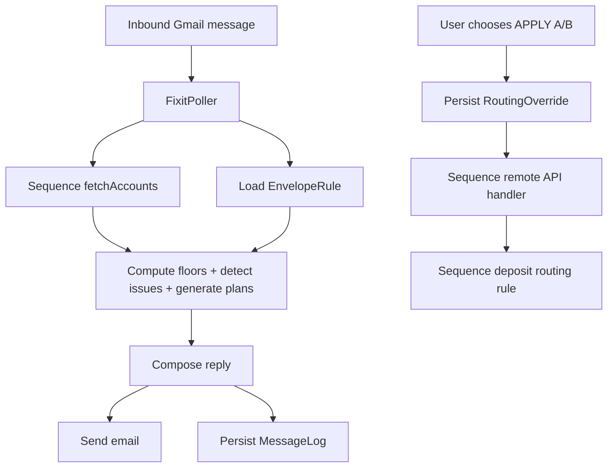

# Temporal envelopes + fixit email + Sequence remote routing

## What stays the same

- Your existing “Savings Total trend sentinel” remains deterministic and continues to run as a cron-style job:
  - Fetch balances via [`src/sequenceClient.ts`](src/sequenceClient.ts)
  - Persist to gist/local via [`src/snapshotStore.ts`](src/snapshotStore.ts)
  - Email via [`src/email.ts`](src/email.ts) + [`src/templates.ts`](src/templates.ts)

## What we’re adding

### 1) Deterministic envelope engine (pods + temporal intent)

- **Goal**: For each Sequence Pod, compute:
  - `balance`
  - `required_floor = monthly_budget * buffer_months`
  - `due_amount` (defaults to `monthly_budget` when omitted)
  - `required_by_due = required_floor + due_amount` (for due-date envelopes)
  - `available_to_spend = balance - required_floor`
  - `status: OK | buffer_breached | due_soon | overdue`

- **New data model** (durable from day one for shared daily use):
  - `EnvelopeRule` (matches your spec)
  - `RoutingBaseline` (basis points per pod; target sum = 10,000)
  - `RoutingOverride` (deltaBps with `remainingDeposits` / expiry)
  - `ProcessedMessage` (Gmail message IDs we’ve handled)
  - `MessageLog` (inbound email + classification + chosen plan)

- **Key files to add** (pure functions wherever possible):
  - [`src/envelopes/types.ts`](src/envelopes/types.ts)
  - [`src/envelopes/computeFloors.ts`](src/envelopes/computeFloors.ts)
  - [`src/envelopes/detectIssues.ts`](src/envelopes/detectIssues.ts)
  - [`src/envelopes/generatePlans.ts`](src/envelopes/generatePlans.ts)
  - [`src/envelopes/policy.ts`](src/envelopes/policy.ts) (borrow order + protected rules)

- **Status logic (minimal, but avoids “balance-only due date” pitfalls)**
  - `buffer_breached`: `available_to_spend < 0`
  - For envelopes with `due_by_day`:
    - Define `due_amount` (defaults to `monthly_budget`)
    - Define `required_by_due = required_floor + due_amount`
    - `due_soon`: `daysUntilNextDue <= DUE_SOON_WINDOW_DAYS` AND `balance < required_by_due`
    - `overdue`: best-effort; requires daily pod balance snapshots to detect “not funded by due day” (see Storage section)
  - otherwise `OK`

### 2) Storage that matches your current constraints

- Keep the existing sentinel persistence exactly as-is (`gist OR local`) via [`src/snapshotStore.ts`](src/snapshotStore.ts).
- For Fixit (multi-user, frequent writes), use **Turso (libSQL / SQLite over HTTP)** as the system of record:
  - avoids gist patch conflicts/races
  - supports idempotency + concurrent actions cleanly
  - is reachable by both the always-on poller and Vercel

- **Files to add**
  - [`src/storage/libsqlClient.ts`](src/storage/libsqlClient.ts) (connect + query helper)
  - [`src/storage/migrations.ts`](src/storage/migrations.ts) (create tables / indices)
  - [`src/storage/envelopeRuleRepo.ts`](src/storage/envelopeRuleRepo.ts)
  - [`src/storage/routingRepo.ts`](src/storage/routingRepo.ts) (baseline + overrides)
  - [`src/storage/processedMessageRepo.ts`](src/storage/processedMessageRepo.ts)
  - [`src/storage/messageLogRepo.ts`](src/storage/messageLogRepo.ts)
  - (Optional) a seed script to import initial rules/baselines from JSON for fast setup

### 3) Email-first “Fix it” loop (Gmail API)

- **Inbound**: Gmail API polling (search unread messages in a label, e.g. `penny_pop/fixit`).
- **Runtime**: run the poller on an always-on worker (e.g. a small DigitalOcean droplet). GitHub Actions remains ideal for the weekly sentinel, but not for minute-level inbound email latency.
- **Deterministic core**:

  1. Fetch current pods (`SequenceAccount.type === "Pod"` from `fetchAccounts()`)
  2. Load `EnvelopeRule[]`
  3. Compute envelope states + detect issues
  4. Generate 2–3 ranked fix options (respecting your borrow policy)

- **AI/communication layer** (non-calculating):
  - Classify email into `timing_shortfall | overspend | structural_underfund | routing_change_request`.
  - Ask **0–1** clarifying question only if the chosen plan can’t be safely applied (e.g., would touch protected pods).
  - Compose a calm reply with options + a recommended path, using consistent **Decision Vocabulary** (below).

- **Files to add**
  - [`src/emailFixit/gmailClient.ts`](src/emailFixit/gmailClient.ts) (list messages, fetch body, mark read)
  - [`src/emailFixit/parseEmail.ts`](src/emailFixit/parseEmail.ts) (extract plain text + basic command parsing)
  - [`src/emailFixit/classifyTask.ts`](src/emailFixit/classifyTask.ts) (start rule-based; later plug LLM)
  - [`src/emailFixit/replyComposer.ts`](src/emailFixit/replyComposer.ts) (formats options + recommendation)
  - [`src/emailFixit/poller.ts`](src/emailFixit/poller.ts) (end-to-end loop + idempotency)

- **New CLI entrypoint**
  - [`src/fixit.ts`](src/fixit.ts) to run the poller (separate from existing `src/index.ts`).

### 4) Sequence “Query Remote API” endpoint (Vercel)

- **Goal**: “Apply these adjustments” for future deposits via routing overrides.
- **Hosting split**:
  - Vercel: `api/sequence-routing.ts` (stateless request/response, reads Turso)
  - Worker: Gmail poller + SMTP + writes Turso
- **Baseline**: store **basis points** (`bps`, integer) per pod; target sum = **10,000**.
- **Overrides**: store `deltaBps` with `remainingDeposits` and apply deterministically.
- **Deterministic application order + clamps**:

  1. Start with baseline bps
  2. Apply active overrides in stable order (`createdAt` ascending)
  3. Clamp:

     - protected pods cannot be reduced below 0 bps unless explicitly allowed (e.g. `ALLOW: SafetyNet`)
     - per-deposit dollar clamp (cap adjustment magnitude; explainable)

  1. Do **not** renormalize automatically; allocate any remaining bps/dollars to a catch-all pod: **`Move to ___`**

- **Rounding**: convert bps→dollars using cent rounding; any penny remainder goes to `Move to ___` so the final amounts sum exactly to the deposit.

- **Files to add**
  - [`src/routing/computeDepositPlan.ts`](src/routing/computeDepositPlan.ts) (baseline % → amounts; apply overrides; clamp)
  - [`src/routing/sequenceRemoteApiHandler.ts`](src/routing/sequenceRemoteApiHandler.ts) (request validation + response format)
  - Vercel function wrapper at [`api/sequence-routing.ts`](api/sequence-routing.ts) (imports compiled handler or uses ts runtime—depending on your build choice)

- **Safety rails**
  - `MAX_ADJUSTMENT_PER_DEPOSIT` (absolute dollars)
  - Never reduce `protected` pods unless explicitly allowed by an email command (e.g. `ALLOW: SafetyNet`).
  - Audit email after storing overrides: “Next deposit routing updated: …”

## Data flow (high-level)

## Implementation notes (specific to this repo)

- Keep your existing deterministic style from [`src/analyze.ts`](src/analyze.ts): pure computations returning typed objects.
- Keep sentinel persistence style from [`src/snapshotStore.ts`](src/snapshotStore.ts): local + gist fallback.
- For Fixit state, prefer “repo + migrations” patterns (Turso) over file patching.

## Decision vocabulary (make replies stable and household-trainable)

Every Fixit email response should label options consistently:

- **Restore plan**: put money back where it came from on a defined timeline (e.g. 14 days / 2 deposits).
- **Routing plan**: adjust the next N deposits (writes overrides) to correct timing/shortfall automatically.
- **Structural plan**: change `monthly_budget`, `buffer_months`, or `due_amount` because the envelope definition is wrong.

The `APPLY A/B` confirmation loop should reference these labels so the system stays predictable.

## Rollout plan (2–3 weeks)

### Week 1: Deterministic envelope engine + Fix it email replies

- Implement Turso schema + repos for `EnvelopeRule`, `ProcessedMessage`, `MessageLog` (and optionally daily pod balance snapshots for due-date “overdue” best-effort).
- Compute floors + `available_to_spend`.
- Implement issue detection (buffer breach + due soon using `required_by_due`) and plan generation (rank donors by policy).
- Implement Gmail API polling on a worker + reply composing (rule-based classification to start).
- Deliverable: you can email “Fix it …” and get grounded options back.

### Week 2: Sequence routing automation (Vercel)

- Implement `RoutingBaseline` (bps) + `RoutingOverride` (deltaBps) in Turso.
- Build Vercel endpoint for Sequence “Query Remote API” that reads Turso and applies deterministic order/clamps/remainder→`Move to ___`.
- Add “APPLY A” style confirmation email flow that writes overrides.
- Add audit email + safety rails.
- Deliverable: accepted plans automatically adjust *next* deposits.

### Week 3: Shared usage + phase/permissions

- Identify sender (Gmail From) → map to `createdBy`.
- Add command parsing: `PHASE: ON_TRIP`, `ALLOW: SafetyNet`, `RESTORE: 14 days`.
- Tighten idempotency and logging.
- Deliverable: both of you can safely use it daily, with predictable behavior.